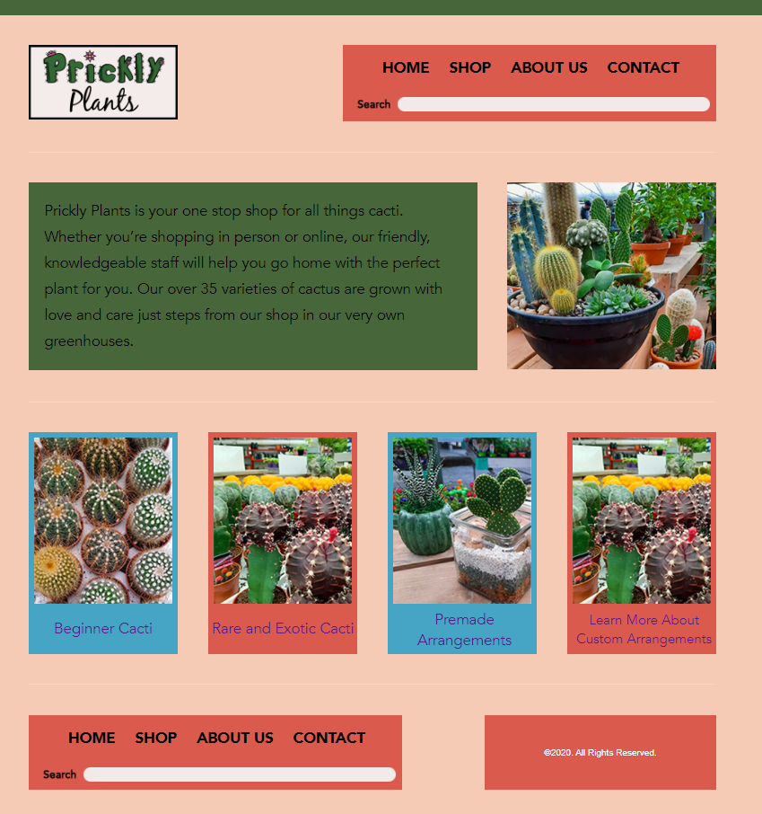
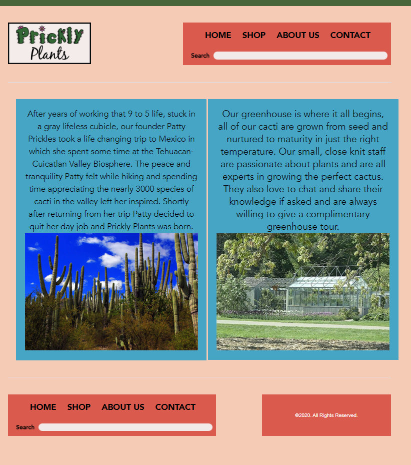
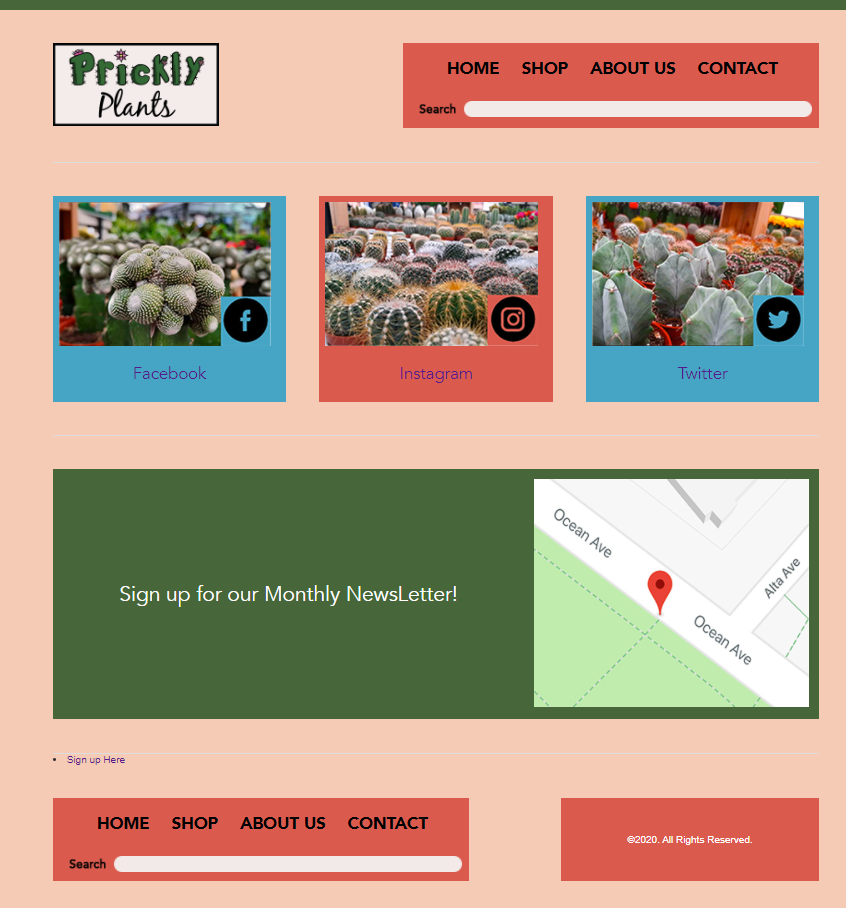

# Emma Luke FIP Website

For my final project I decided to make a website for a cactus shop named "Prickly Plants". It is a 4 page Website with a HomePage, Shop page, About Us page, and a Contact page. 

## Installation
How to install

Install Sublime 3 https://www.sublimetext.com/3

## Usage
How to use

After installing Sublime download all files and  open in browser

## Credits
Stock Pictures Used

https://www.istockphoto.com/photo/portrait-of-a-plant-shop-owner-working-gm1225272919-360587034

https://www.shutterstock.com/image-photo/flora-tehuacancuicatlan-biosphere-reserve-mexico-puebla-1277041393?irclickid=2Wb24Cz6HxyLRb-wUx0Mo38PUkE3x43BQw2BSM0&irgwc=1&utm_medium=Affiliate&utm_campaign=TinEye&utm_source=77643&utm_term=&c3ch=Affiliate&c3nid=IR-77643

https://www.stockfreeimages.com/9447923/Greenhouse.html?fbclid=IwAR0QeIH5WQYrQH1OCxDQr2_ipvVA0fePzGnYmVzQenLg2darjH9b6UixVMk

https://www.pinterest.ca/pin/705235622876895258/?autologin=true

## Screenshots
Screenshots of Website

## MIT Licence
MIT Licence

Copyright 2020 Emma Luke

Permission is hereby granted, free of charge, to any person obtaining a copy of this software and associated documentation files (the "Software"), to deal in the Software without restriction, including without limitation the rights to use, copy, modify, merge, publish, distribute, sublicense, and/or sell copies of the Software, and to permit persons to whom the Software is furnished to do so, subject to the following conditions:

The above copyright notice and this permission notice shall be included in all copies or substantial portions of the Software.

THE SOFTWARE IS PROVIDED "AS IS", WITHOUT WARRANTY OF ANY KIND, EXPRESS OR IMPLIED, INCLUDING BUT NOT LIMITED TO THE WARRANTIES OF MERCHANTABILITY, FITNESS FOR A PARTICULAR PURPOSE AND NONINFRINGEMENT. IN NO EVENT SHALL THE AUTHORS OR COPYRIGHT HOLDERS BE LIABLE FOR ANY CLAIM, DAMAGES OR OTHER LIABILITY, WHETHER IN AN ACTION OF CONTRACT, TORT OR OTHERWISE, ARISING FROM, OUT OF OR IN CONNECTION WITH THE SOFTWARE OR THE USE OR OTHER DEALINGS IN THE SOFTWARE.